# 📚 基于Hive+Spark的高校图书馆借阅行为分析系统

> **毕业设计项目** | 课题：基于Hive+Spark的高校图书馆借阅行为分析系统的设计与实现

[](https://www.oracle.com/java/)
[](https://spring.io/projects/spring-boot)
[](https://vuejs.org/)
[](https://hadoop.apache.org/)
[](https://hive.apache.org/)
[](https://spark.apache.org/)

## 📋 项目简介

本项目是一个基于大数据技术栈的高校图书馆借阅行为分析系统，采用**分层数据仓库架构**（ODS→DWD→DWS→ADS），通过**Hive**进行数据存储与管理，**Spark**进行数据处理与分析，实现了从原始数据到业务应用的完整数据链路。系统提供多角色权限管理，支持统计分析、个性化推荐、数据挖掘和预测分析等功能。

### ✨ 核心特性

- 🏗️ **分层数据仓库架构**：ODS原始数据层 → DWD明细数据层 → DWS汇总数据层 → ADS应用数据层
- 📊 **多维度统计分析**：热门图书、活跃用户、院系偏好、借阅趋势、时间分布等
- 🤖 **智能推荐系统**：基于ALS协同过滤、内容过滤和热门推荐的混合推荐算法
- 🔍 **数据挖掘分析**：FPGrowth关联规则挖掘、K-means用户聚类分析
- 📈 **预测分析模型**：逾期风险预测、借阅趋势预测、图书热度预测
- 👥 **多角色权限管理**：高级管理员、图书管理员、普通用户三级权限体系
- 📱 **现代化前端界面**：基于Vue 3 + Element Plus的响应式设计
- 🔄 **完整数据链路**：从CSV原始数据到HDFS，经过Spark处理，最终导出到MySQL供业务系统使用

## 🏗️ 系统架构

### 系统整体架构图

```
┌─────────────────────────────────────────────────────────────────────────────┐
│                              用户访问层                                      │
│                    ┌──────────────────────────────┐                        │
│                    │   Vue 3 前端应用              │                        │
│                    │   (Element Plus + ECharts)   │                        │
│                    └──────────────┬───────────────┘                        │
│                                   │ HTTP/HTTPS                              │
└───────────────────────────────────┼───────────────────────────────────────┘
                                    │
┌───────────────────────────────────▼───────────────────────────────────────┐
│                           应用服务层                                        │
│                    ┌──────────────────────────────┐                        │
│                    │   Spring Boot 后端服务        │                        │
│                    │   (RESTful API + JWT认证)    │                        │
│                    └──────────────┬───────────────┘                        │
│                                   │ JDBC                                    │
└───────────────────────────────────┼───────────────────────────────────────┘
                                    │
┌───────────────────────────────────▼───────────────────────────────────────┐
│                           业务数据层                                        │
│                    ┌──────────────────────────────┐                        │
│                    │   MySQL 业务数据库            │                        │
│                    │   (30张业务表 + 1张系统表)   │                        │
│                    └──────────────────────────────┘                        │
└─────────────────────────────────────────────────────────────────────────────┘

┌─────────────────────────────────────────────────────────────────────────────┐
│                          大数据处理层                                        │
│                                                                              │
│  ┌──────────────┐    ┌──────────────┐    ┌──────────────┐                  │
│  │   HDFS       │    │   Hive      │    │   Spark      │                  │
│  │  (分布式存储) │◄───►│  (数据仓库) │◄───►│  (计算引擎)  │                  │
│  └──────────────┘    └──────────────┘    └──────────────┘                  │
│         ▲                    ▲                    ▲                        │
│         │                    │                    │                        │
│         └────────────────────┴────────────────────┘                        │
│                              │                                               │
│                    ┌─────────▼─────────┐                                    │
│                    │  数据仓库分层架构  │                                    │
│                    │  ODS → DWD → DWS → ADS                                │
│                    └─────────┬─────────┘                                    │
│                              │                                               │
│                    ┌─────────▼─────────┐                                    │
│                    │  Spark数据处理    │                                    │
│                    │  (PySpark脚本)    │                                    │
│                    └─────────┬─────────┘                                    │
│                              │                                               │
│                    ┌─────────▼─────────┐                                    │
│                    │  数据导出到MySQL  │                                    │
│                    └───────────────────┘                                    │
└─────────────────────────────────────────────────────────────────────────────┘

┌─────────────────────────────────────────────────────────────────────────────┐
│                          数据源层                                            │
│                    ┌──────────────────────────────┐                        │
│                    │   CSV原始数据文件             │                        │
│                    │   (LENDHIST2019_2020.csv)    │                        │
│                    └──────────────────────────────┘                        │
└─────────────────────────────────────────────────────────────────────────────┘
```

### 技术栈

#### 后端技术
- **框架**：Spring Boot 2.7.18
- **ORM**：MyBatis-Plus 3.5.3.1
- **数据库**：MySQL 8.0.33
- **连接池**：Druid 1.2.20
- **认证**：JWT (io.jsonwebtoken 0.11.5)
- **API文档**：Swagger 3.0.0
- **工具类**：Hutool 5.8.22

#### 前端技术
- **框架**：Vue 3.3.4
- **构建工具**：Vite 4.5.0
- **UI组件库**：Element Plus 2.3.14
- **状态管理**：Pinia 2.1.7
- **路由**：Vue Router 4.2.5
- **图表库**：ECharts 5.4.3
- **HTTP客户端**：Axios 1.6.2

#### 大数据技术
- **分布式存储**：Hadoop 3.3.6
- **数据仓库**：Hive 3.1.2
- **计算引擎**：Spark 3.5.6
- **数据处理**：PySpark 3.5.6 + Pandas
- **数据库**：MySQL 8.0.33

### 数据仓库分层

```
┌─────────────────────────────────────────────────────────┐
│                      CSV原始数据                          │
└──────────────────────┬──────────────────────────────────┘
                       │
                       ▼
┌─────────────────────────────────────────────────────────┐
│  ODS层 (原始数据层)                                       │
│  - ods_library_lend: 原始借阅数据                        │
└──────────────────────┬──────────────────────────────────┘
                       │ Spark数据清洗
                       ▼
┌─────────────────────────────────────────────────────────┐
│  DWD层 (明细数据层)                                       │
│  - dwd_user_info: 用户维度表                             │
│  - dwd_book_info: 图书维度表                             │
│  - dwd_lend_detail: 借阅明细事实表                       │
└──────────────────────┬──────────────────────────────────┘
                       │ Spark数据汇总
                       ▼
┌─────────────────────────────────────────────────────────┐
│  DWS层 (汇总数据层)                                       │
│  - dws_user_lend_summary: 用户借阅汇总                   │
│  - dws_book_lend_summary: 图书借阅汇总                   │
│  - dws_dept_lend_summary: 院系借阅汇总                   │
│  - dws_subject_lend_summary: 主题分类汇总                │
│  - dws_daily_stats: 每日统计                             │
└──────────────────────┬──────────────────────────────────┘
                       │ Spark数据分析
                       ▼
┌─────────────────────────────────────────────────────────┐
│  ADS层 (应用数据层)                                       │
│  - ads_hot_books: 热门图书TOP100                         │
│  - ads_active_users: 活跃用户TOP100                      │
│  - ads_dept_preference: 院系偏好分析                     │
│  - ads_lend_trend: 借阅趋势                             │
│  - ads_operation_dashboard: 运营看板                    │
│  - ads_user_profile: 用户画像分析                       │
│  - ads_major_reading_profile: 专业阅读特征               │
│  - ads_collection_utilization: 馆藏利用分析              │
│  - ads_overdue_analysis: 逾期分析                        │
│  - ads_time_distribution: 时间分布分析                   │
│  - ads_user_ranking: 用户排名                            │
│  - ads_book_recommend_base: 图书推荐基础表                │
│  - ads_publisher_analysis: 出版社分析                     │
│  - ads_publish_year_analysis: 出版年份分析                │
│  - ads_book_association: 图书关联规则（可选）             │
│  - ads_user_cluster: 用户聚类分群（可选）                 │
└──────────────────────┬──────────────────────────────────┘
                       │ Spark数据导出
                       ▼
┌─────────────────────────────────────────────────────────┐
│                    MySQL业务数据库                        │
│                    (31张表)                              │
└──────────────────────┬──────────────────────────────────┘
                       │
                       ▼
┌─────────────────────────────────────────────────────────┐
│               Spring Boot后端API服务                      │
└──────────────────────┬──────────────────────────────────┘
                       │
                       ▼
┌─────────────────────────────────────────────────────────┐
│              Vue 3前端应用 (Element Plus)                 │
└─────────────────────────────────────────────────────────┘
```

## 📁 项目结构

```
library-analysis-system/
├── backend/                          # 后端服务
│   ├── src/main/java/com/library/
│   │   ├── common/                   # 通用类（Result、PageResult等）
│   │   ├── config/                   # 配置类（CORS、MyBatis-Plus、Swagger）
│   │   ├── controller/               # 控制器（6个Controller）
│   │   ├── dto/                      # 数据传输对象
│   │   ├── entity/                   # 实体类（31个实体）
│   │   ├── exception/                # 异常处理
│   │   ├── mapper/                   # MyBatis Mapper（31个Mapper）
│   │   ├── service/                  # 服务层
│   │   ├── utils/                    # 工具类（JWT等）
│   │   └── vo/                       # 视图对象
│   └── src/main/resources/
│       └── application.yml           # 应用配置
│
├── frontend/                         # 前端应用
│   ├── src/
│   │   ├── api/                      # API接口定义
│   │   ├── layouts/                  # 布局组件（Admin、Librarian、User）
│   │   ├── router/                   # 路由配置
│   │   ├── stores/                   # Pinia状态管理
│   │   ├── utils/                    # 工具函数
│   │   └── views/                    # 页面视图
│   │       ├── admin/                # 高级管理员页面（9个页面）
│   │       ├── librarian/            # 图书管理员页面（7个页面）
│   │       └── user/                 # 普通用户页面（6个页面）
│   ├── package.json
│   └── vite.config.js
│
├── bigdata/                          # 大数据处理
│   ├── hive/                         # Hive数据仓库SQL
│   │   ├── 01_create_ods.sql         # ODS层表结构
│   │   ├── 02_create_dwd.sql         # DWD层表结构
│   │   ├── 03_create_dws.sql         # DWS层表结构
│   │   └── 04_create_ads.sql         # ADS层表结构
│   ├── spark/                        # Spark处理脚本
│   │   ├── 01_data_clean.py          # 数据清洗（ODS→DWD）
│   │   ├── 02_data_aggregate.py      # 数据汇总（DWD→DWS）
│   │   ├── 03_data_analyze.py        # 数据分析（DWS→ADS）
│   │   ├── 04_data_export.py         # 数据导出（Hive→MySQL）
│   │   ├── 05_book_recommend.py      # 图书推荐算法
│   │   ├── 06_advanced_analysis.py    # 高级数据挖掘（FPGrowth+K-means）
│   │   ├── 07_prediction_models.py   # 预测分析模型
│   │   └── requirements.txt          # Python依赖
│   └── mysql/
│       └── init_mysql.sql            # MySQL数据库初始化（31张表）
│
├── data/                             # 数据文件
│   └── LENDHIST2019_2020.csv         # 原始借阅数据
│
└── deploy/                           # 部署脚本
    ├── run.sh                        # 数据链路执行脚本
    ├── verify.sh                     # 数据验证脚本
    ├── clean_old_data.sh             # 数据清理脚本
    └── config.sh                     # 配置脚本
```

## 🚀 快速开始

> 💡 **想要5分钟快速启动？** 查看 [QUICKSTART.md](QUICKSTART.md) 快速启动指南

### 环境要求

#### 必需组件
- **JDK**: 1.8+
- **Hadoop**: 3.3.6
- **Hive**: 3.1.2
- **Spark**: 3.5.6
- **MySQL**: 8.0.33+
- **Python**: 3.8+

#### 可选组件（前后端）
- **Node.js**: 16+
- **Maven**: 3.6+

#### 推荐集群配置（10万条数据）
| 节点 | 角色 | 配置 |
|-----|------|------|
| master | NameNode, ResourceManager, Hive Metastore | 8G内存, 4核CPU |
| slave1 | DataNode, NodeManager | 4G内存, 4核CPU |
| slave2 | DataNode, NodeManager | 4G内存, 4核CPU |

### 安装步骤

#### 1. 环境准备

确保以下服务正常运行：

```bash
# 检查Hadoop集群
hdfs dfsadmin -report
yarn node -list

# 检查Hive Metastore
jps | grep HiveMetaStore
hive -e "SHOW DATABASES"

# 检查Spark
spark-submit --version
```

#### 2. 初始化MySQL数据库

```bash
mysql -uroot -p < bigdata/mysql/init_mysql.sql
mysql -uroot -p library_analysis -e "SHOW TABLES;"
# 预期输出：31张表
```

#### 3. 准备数据文件

将CSV数据文件上传到Hadoop集群：
（原始数据为逗号分隔CSV，Spark脚本按逗号分隔读取）

```bash
# 上传到HDFS
hdfs dfs -put data/LENDHIST2019_2020.csv /data/library/raw/
```

#### 4. 安装Python依赖

```bash
pip3 install -r bigdata/spark/requirements.txt
```

#### 5. 执行数据链路

```bash
cd deploy
bash run.sh
```

数据链路包含以下步骤：
1. 上传原始数据到HDFS
2. 创建Hive表结构（ODS/DWD/DWS/ADS）
3. 数据清洗（ODS → DWD）
4. 数据汇总（DWD → DWS）
5. 数据分析（DWS → ADS）
6. 导出MySQL（Hive → MySQL）
7. 推荐算法（可选）- 执行 `05_book_recommend.py`
8. 高级数据挖掘（可选）- 执行 `06_advanced_analysis.py`（FPGrowth关联规则 + K-means用户聚类）
9. 预测模型（可选）- 执行 `07_prediction_models.py`

#### 6. 启动后端服务

```bash
cd backend
mvn clean package
java -jar target/library-analysis-system-1.0.0.jar
```

后端服务启动后：
- API地址：http://localhost:8080/api
- Swagger文档：http://localhost:8080/api/swagger-ui/index.html
- Druid监控：http://localhost:8080/api/druid/index.html

#### 7. 启动前端服务

```bash
cd frontend
npm install
npm run dev
```

前端服务启动后访问：http://localhost:3000

### 验证部署

```bash
cd deploy
bash verify.sh
```

## 👥 用户角色与功能

### 🔴 系统管理员（高级管理员）（userType=1）

**战略决策层**，负责整体运营分析和数据挖掘：

- **运营看板**：整体数据概览、关键指标监控
- **用户画像**：用户行为特征、阅读偏好分析
- **专业阅读**：各专业阅读行为特征分析
- **推荐监控**：推荐算法效果评估
- **馆藏利用**：图书利用率、馆藏分布分析（含位置/主题维度）
- **出版分析**：出版社和出版年份综合分析
- **预测分析**：逾期风险、借阅趋势、图书热度预测
- **图书关联分析**：基于FPGrowth算法的关联规则挖掘
- **用户聚类分析**：基于K-means算法的用户分群

### 🟡 图书管理员（userType=2）

**业务执行层**，负责日常业务管理和统计分析：

- **工作台**：业务数据概览
- **借阅记录查询**：借阅记录查询与管理
- **逾期情况分析**：逾期数据统计分析
- **活跃用户分析**：TOP100活跃用户
- **图书排行与分析**：多维度图书排行榜
- **图书详情分析**：单本图书借阅分析
- **时间与续借分析**：借阅时间分布和续借行为分析

### 🟢 普通用户（userType=3）

**学生/教师**，查看个人数据和推荐：

- **个人中心**：个人借阅数据概览
- **借阅记录**：历史借阅记录查询
- **图书推荐**：个性化推荐图书
- **我的阅读画像**：个人阅读特征分析
- **我的排名**：在全校/院系中的排名
- **借阅日历**：借阅时间可视化

## 📊 核心功能模块

### 功能模块架构图

```
┌─────────────────────────────────────────────────────────────────────────────┐
│                        图书馆借阅分析系统功能模块                              │
└─────────────────────────────────────────────────────────────────────────────┘

┌─────────────────────────────────────────────────────────────────────────────┐
│  1. 数据仓库建设模块                                                          │
│  ┌──────────┐  ┌──────────┐  ┌──────────┐  ┌──────────┐                  │
│  │  ODS层   │─►│  DWD层   │─►│  DWS层   │─►│  ADS层   │                  │
│  │ 原始数据  │  │ 明细数据  │  │ 汇总数据  │  │ 应用数据  │                  │
│  └──────────┘  └──────────┘  └──────────┘  └──────────┘                  │
│       │             │             │             │                          │
│       └─────────────┴─────────────┴─────────────┘                          │
│                         Spark ETL处理流程                                   │
└─────────────────────────────────────────────────────────────────────────────┘
                                    │
                                    ▼
┌─────────────────────────────────────────────────────────────────────────────┐
│  2. 统计分析模块                                                              │
│  ┌──────────────┐  ┌──────────────┐  ┌──────────────┐                    │
│  │ 热门图书分析  │  │ 活跃用户分析  │  │ 院系偏好分析  │                    │
│  └──────────────┘  └──────────────┘  └──────────────┘                    │
│  ┌──────────────┐  ┌──────────────┐  ┌──────────────┐                    │
│  │ 借阅趋势分析  │  │ 时间分布分析  │  │ 逾期分析     │                    │
│  └──────────────┘  └──────────────┘  └──────────────┘                    │
└─────────────────────────────────────────────────────────────────────────────┘
                                    │
                                    ▼
┌─────────────────────────────────────────────────────────────────────────────┐
│  3. 推荐系统模块                                                              │
│                                                                              │
│         ┌──────────────────────────────────────┐                            │
│         │      混合推荐算法引擎                │                            │
│         └───────────┬────────────────────────┘                            │
│                     │                                                        │
│    ┌────────────────┼────────────────┐                                    │
│    │                │                │                                    │
│    ▼                ▼                ▼                                    │
│  ┌─────────┐  ┌─────────┐  ┌─────────┐                                    │
│  │ ALS协同 │  │ 内容过滤 │  │ 热门推荐 │                                    │
│  │ 过滤算法 │  │ 算法    │  │ 算法    │                                    │
│  └─────────┘  └─────────┘  └─────────┘                                    │
│       │            │            │                                          │
│       └────────────┴────────────┘                                          │
│                  │                                                          │
│                  ▼                                                          │
│         ┌─────────────────┐                                                │
│         │  个性化推荐列表  │                                                │
│         └─────────────────┘                                                │
└─────────────────────────────────────────────────────────────────────────────┘
                                    │
                                    ▼
┌─────────────────────────────────────────────────────────────────────────────┐
│  4. 数据挖掘模块                                                              │
│  ┌──────────────────────┐  ┌──────────────────────┐                      │
│  │  FPGrowth关联规则     │  │  K-means用户聚类      │                      │
│  │  挖掘图书关联关系     │  │  识别阅读偏好群体     │                      │
│  └──────────────────────┘  └──────────────────────┘                      │
└─────────────────────────────────────────────────────────────────────────────┘
                                    │
                                    ▼
┌─────────────────────────────────────────────────────────────────────────────┐
│  5. 预测分析模块                                                              │
│  ┌──────────────────────┐  ┌──────────────────────┐                      │
│  │ 逾期风险预测         │  │ 借阅趋势预测          │                      │
│  │ (随机森林算法)       │  │ (时间序列回归)        │                      │
│  └──────────────────────┘  └──────────────────────┘                      │
│  ┌──────────────────────┐                                                │
│  │ 图书热度预测          │                                                │
│  │ (时间序列预测)        │                                                │
│  └──────────────────────┘                                                │
└─────────────────────────────────────────────────────────────────────────────┘

┌─────────────────────────────────────────────────────────────────────────────┐
│                          用户角色权限体系                                    │
│                                                                              │
│  ┌──────────────────┐  ┌──────────────────┐  ┌──────────────────┐      │
│  │  高级管理员       │  │  图书管理员       │  │  普通用户         │      │
│  │  (userType=1)    │  │  (userType=2)    │  │  (userType=3)     │      │
│  │                  │  │                  │  │                  │      │
│  │ • 运营分析        │  │ • 业务管理        │  │ • 个人数据        │      │
│  │ • 数据挖掘        │  │ • 统计分析        │  │ • 图书推荐        │      │
│  │ • 预测分析        │  │ • 逾期管理        │  │ • 阅读画像        │      │
│  │ • 系统监控        │  │ • 时间分析        │  │ • 排名查询        │      │
│  └──────────────────┘  └──────────────────┘  └──────────────────┘      │
└─────────────────────────────────────────────────────────────────────────────┘
```

### 1. 数据仓库建设

- **ODS层**：原始数据存储，直接映射CSV文件结构
- **DWD层**：数据清洗，生成用户、图书维度表和借阅明细事实表
- **DWS层**：数据汇总，按用户、图书、院系、主题、日期维度汇总
- **ADS层**：应用数据，生成14张核心分析表供业务系统使用（高级数据挖掘可选生成关联规则/用户聚类等附加表）

### 2. 统计分析

- **热门图书分析**：TOP100热门图书，支持多维度排序
- **活跃用户分析**：TOP100活跃用户，借阅量统计
- **院系偏好分析**：各院系借阅偏好、主题分布
- **借阅趋势分析**：时间序列趋势、同比环比分析
- **时间分布分析**：按小时、星期、月份分析借阅模式
- **逾期分析**：逾期率统计、逾期用户分析

### 3. 推荐系统

采用**混合推荐算法**，结合三种推荐策略：

- **ALS协同过滤**：基于用户借阅历史的相似度推荐
- **内容过滤**：基于图书主题相似度的推荐
- **热门推荐**：基于借阅热度的推荐
- **混合推荐**：加权融合三种算法，生成个性化推荐列表

### 4. 数据挖掘

- **FPGrowth关联规则**：挖掘图书之间的关联关系（如：借阅A图书的用户也倾向于借阅B图书）
- **K-means用户聚类**：将用户分为不同群体，分析群体特征

### 5. 预测分析

- **逾期风险预测**：基于用户历史行为预测逾期风险
- **借阅趋势预测**：预测未来借阅量趋势
- **图书热度预测**：预测图书未来热度变化
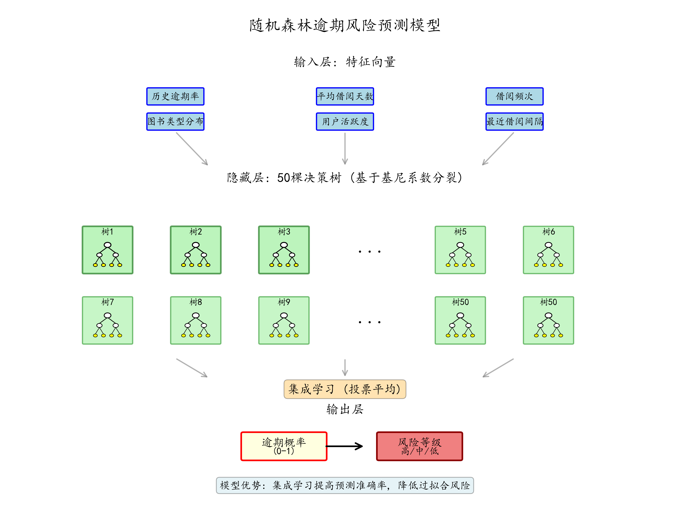

### 6. 高级数据挖掘

- **FPGrowth关联规则挖掘**：通过 `06_advanced_analysis.py` 执行，挖掘图书之间的关联关系
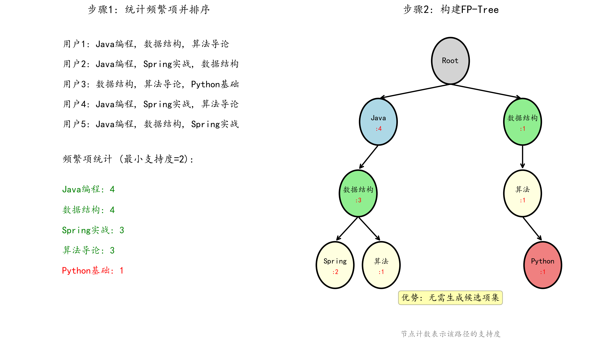
- **K-means用户聚类**：通过 `06_advanced_analysis.py` 执行，将用户分为不同阅读偏好群体
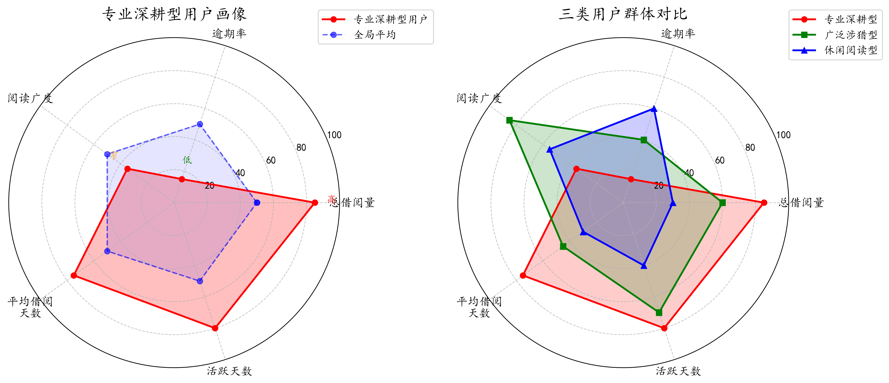

## 🔧 配置说明

### 后端配置

编辑 `backend/src/main/resources/application.yml`：

```yaml
spring:
  datasource:
    url: jdbc:mysql://master:3306/library_analysis
    username: root
    password: your_password

jwt:
  secret: your_jwt_secret
  expiration: 604800  # 7天
```

### 前端配置

前端默认通过 `baseURL: '/api'` 访问后端，开发环境由 Vite 代理转发（见 `frontend/vite.config.js` 的 `server.proxy`）。

```javascript
const request = axios.create({
  baseURL: '/api',
  timeout: 30000
})
```

### 大数据配置

编辑 `deploy/config.sh`，配置运行环境信息（默认示例为 Linux/集群路径与主机名，Windows 建议使用 WSL 或在远程 Linux 节点执行，并按实际环境修改）：

```bash
# HDFS路径配置
export HDFS_RAW_PATH="/data/library/raw"
export LOCAL_CSV_FILE="/opt/project/library-analysis-system/data/LENDHIST2019_2020.csv"

# Spark脚本目录
export PYTHON_SCRIPT_DIR="/opt/project/library-analysis-system/bigdata/spark"

# MySQL配置
export MYSQL_HOST="master"
export MYSQL_USER="root"
export MYSQL_PASSWORD="your_password"
export MYSQL_DATABASE="library_analysis"

# MySQL JDBC驱动
export MYSQL_JDBC_JAR="/opt/app/spark/jars/mysql-connector-j-8.0.33.jar"
```

## 📝 数据库设计

系统共包含**30张业务表 + 1张系统表（sys_user）**，共31张表，业务表分为以下类别：

### 维度表（3张）
- `user_dimension`：用户维度信息
- `book_dimension`：图书维度信息
- `recent_lend_records`：最近6个月借阅记录

### 汇总表（5张）
- `user_lend_summary`：用户借阅汇总
- `book_lend_summary`：图书借阅汇总
- `dept_lend_summary`：院系借阅汇总
- `subject_lend_summary`：主题分类汇总
- `daily_stats`：每日统计

### 聚合表（5张）
- `hot_books`：热门图书TOP100
- `active_users`：活跃用户TOP100
- `dept_preference`：院系偏好
- `lend_trend`：借阅趋势
- `operation_dashboard`：运营看板

### 推荐与功能表（11张）
- `book_recommendations`：个性化推荐
- `recommendation_stats`：推荐效果统计
- `user_profile`：用户画像分析
- `major_reading_profile`：专业阅读特征
- `overdue_analysis`：逾期分析
- `collection_utilization_analysis`：馆藏利用分析
- `publisher_analysis`：出版社分析
- `publish_year_analysis`：出版年份分析
- `time_distribution`：时间分布分析
- `user_ranking`：用户排名
- `book_recommend_base`：图书推荐基础表

### 数据挖掘表（3张）
- `book_association_rules`：图书关联规则（FPGrowth）
- `user_clusters`：用户聚类分群（K-means）
- `cluster_summary`：聚类统计摘要

### 预测分析表（3张）
- `overdue_risk_prediction`：逾期风险预测
- `lend_trend_prediction`：借阅趋势预测
- `book_heat_prediction`：图书热度预测

## 🧪 测试

### 数据链路验证

```bash
cd deploy
bash verify.sh
```

验证脚本会检查：
- HDFS数据文件
- Hive表结构
- 数据量统计
- MySQL表数据

### API测试

访问Swagger文档进行接口测试：
http://localhost:8080/api/swagger-ui/index.html

## 📖 使用说明

### 数据更新流程

1. **准备新数据**：将新的CSV文件上传到HDFS
2. **执行数据链路**：运行 `deploy/run.sh` 重新处理数据
3. **验证数据**：运行 `deploy/verify.sh` 验证数据完整性
4. **重启服务**：重启后端服务使新数据生效

### 推荐算法更新

```bash
# 执行推荐算法
spark-submit --master yarn \
  --jars /opt/app/spark/jars/mysql-connector-j-8.0.33.jar \
  bigdata/spark/05_book_recommend.py
```

### 高级数据挖掘更新

```bash
# 执行高级数据挖掘（FPGrowth关联规则 + K-means用户聚类）
spark-submit --master yarn \
  --jars /opt/app/spark/jars/mysql-connector-j-8.0.33.jar \
  bigdata/spark/06_advanced_analysis.py
```

### 预测模型更新

```bash
# 执行预测模型
spark-submit --master yarn \
  --jars /opt/app/spark/jars/mysql-connector-j-8.0.33.jar \
  bigdata/spark/07_prediction_models.py
```

## 🐛 常见问题

### 1. Hive表创建失败

**问题**：执行Hive SQL时提示表已存在

**解决**：
```bash
# 删除旧表
hive -e "DROP TABLE IF EXISTS library_ods.ods_library_lend;"
# 重新执行创建脚本
hive -f bigdata/hive/01_create_ods.sql
```

### 2. Spark任务失败

**问题**：Spark任务执行失败，提示内存不足

**解决**：
- 检查YARN资源分配
- 调整Spark executor内存配置
- 减少数据量或增加集群资源

### 3. MySQL连接失败

**问题**：Spark导出数据到MySQL失败

**解决**：
- 检查MySQL服务是否启动
- 确认MySQL JDBC驱动路径正确
- 检查MySQL用户权限

### 4. 前端API请求失败

**问题**：前端无法访问后端API

**解决**：
- 检查后端服务是否启动
- 确认CORS配置正确
- 检查API地址配置

## 📸 系统展示


### 登录页面

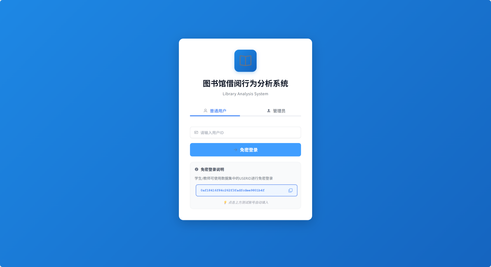

### 高级管理员页面

| 运营综合看板 | 馆藏利用分析 |
|-------------|-------------|
| 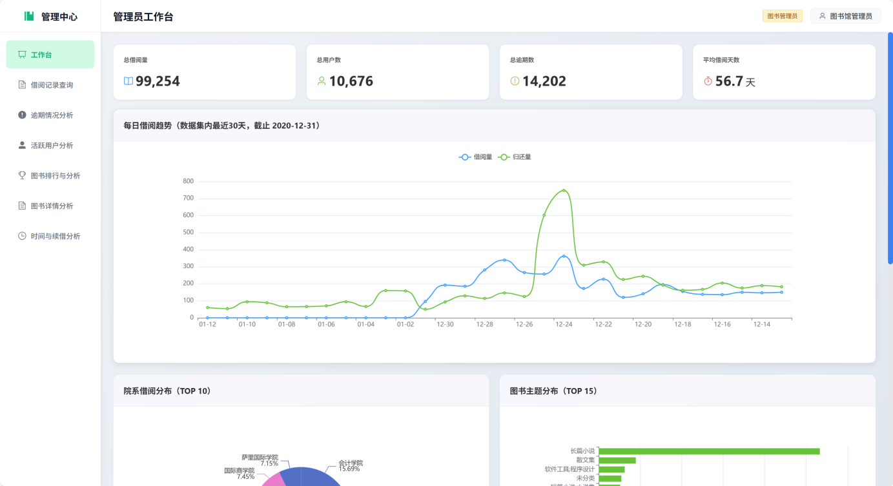 | 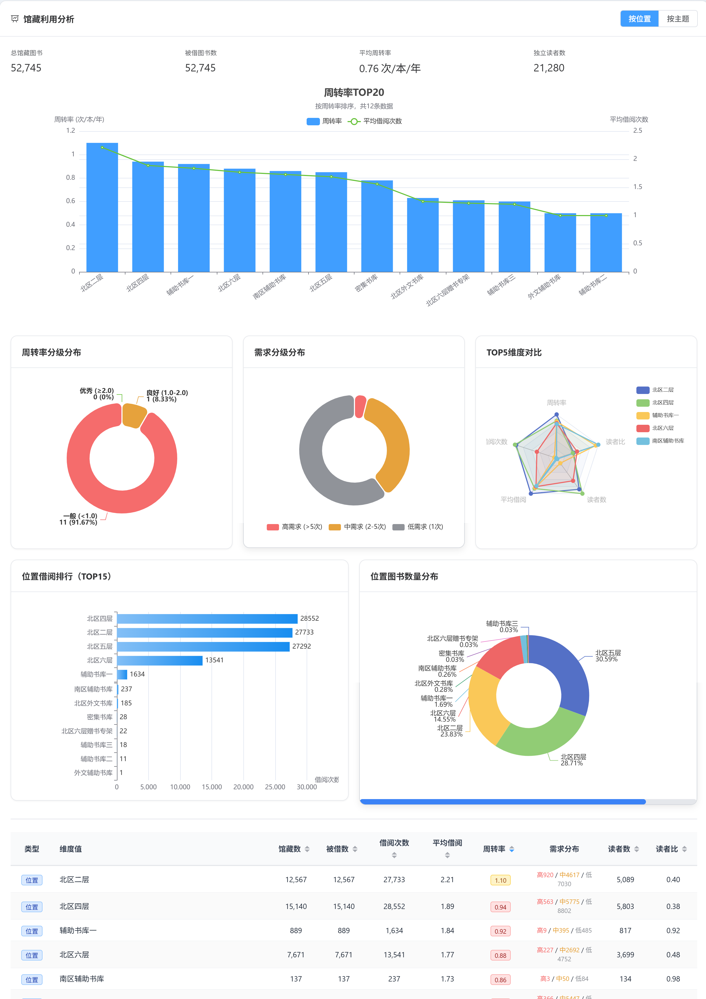 |

| 用户聚类分析 | 预测分析 |
|---------|-------------|
| 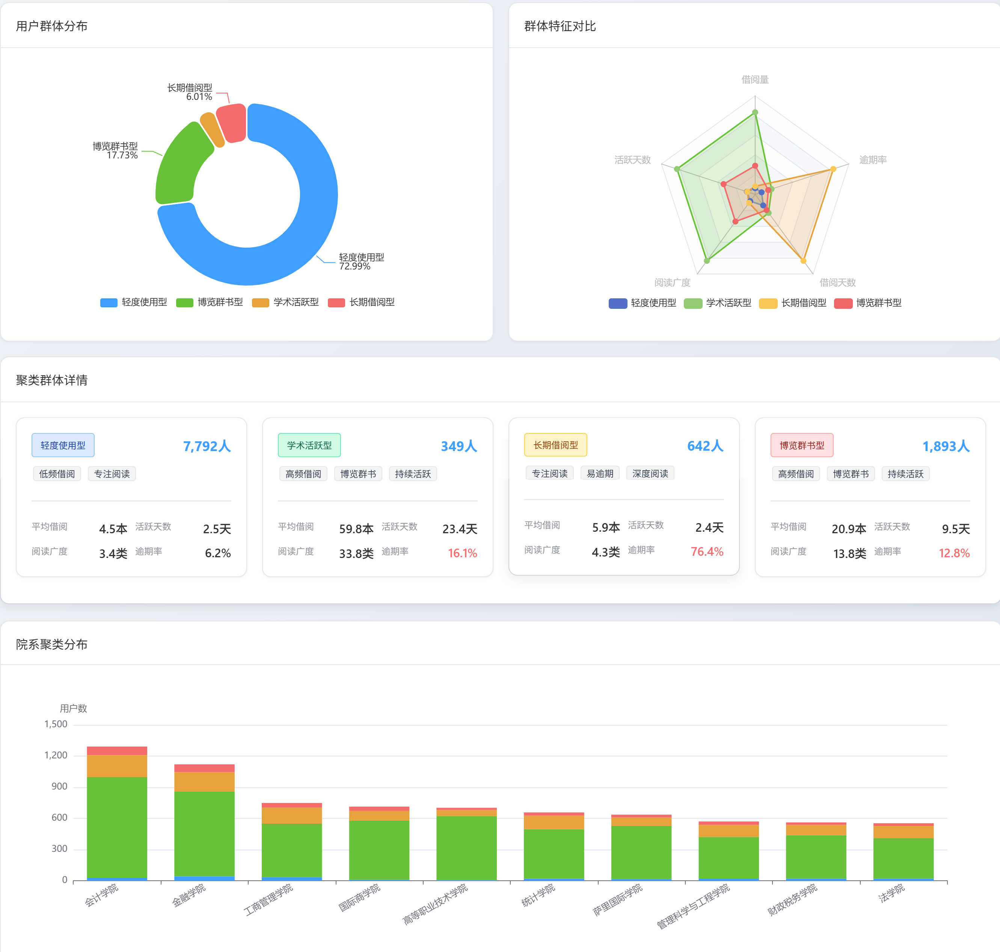 | 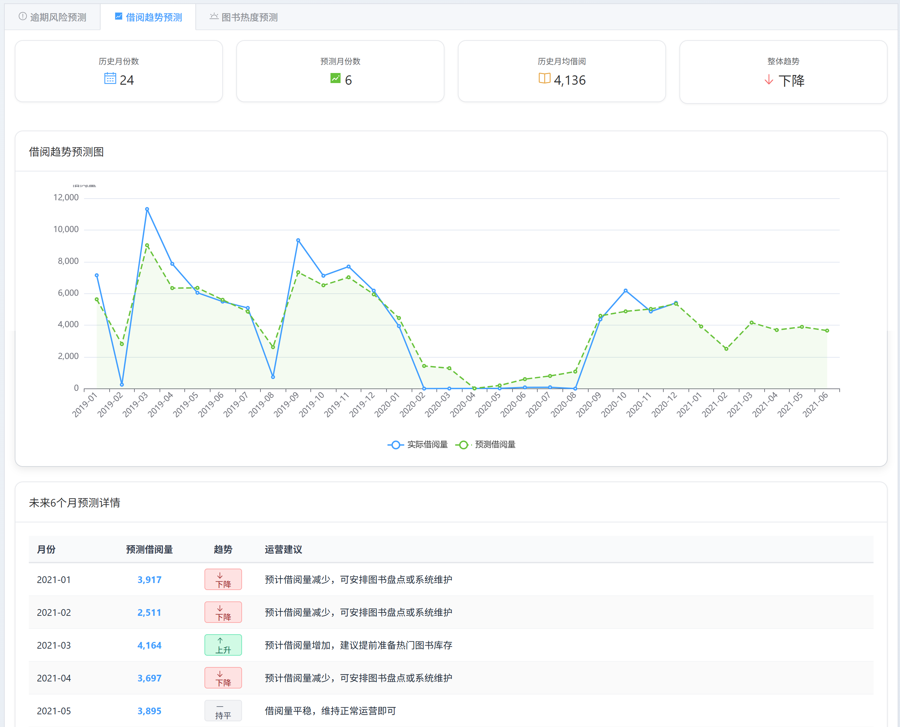 |

| 图书关联分析 | 推荐监控 |
|---------|-------------|
| 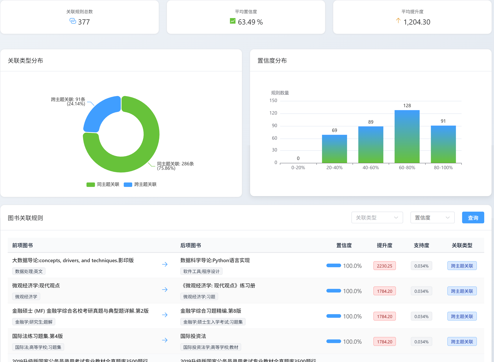 | 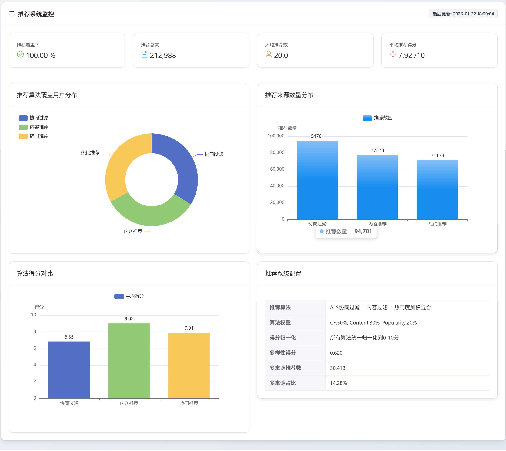 |

### 图书管理员页面

| 工作台 | 图书排行与分析 |
|-------|---------------|
| 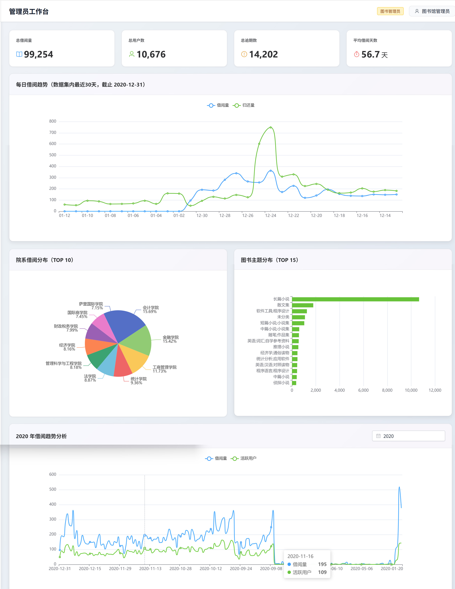 |  |

| 时间分布分析 | 逾期情况分析 |
|-------------|-------------|
| 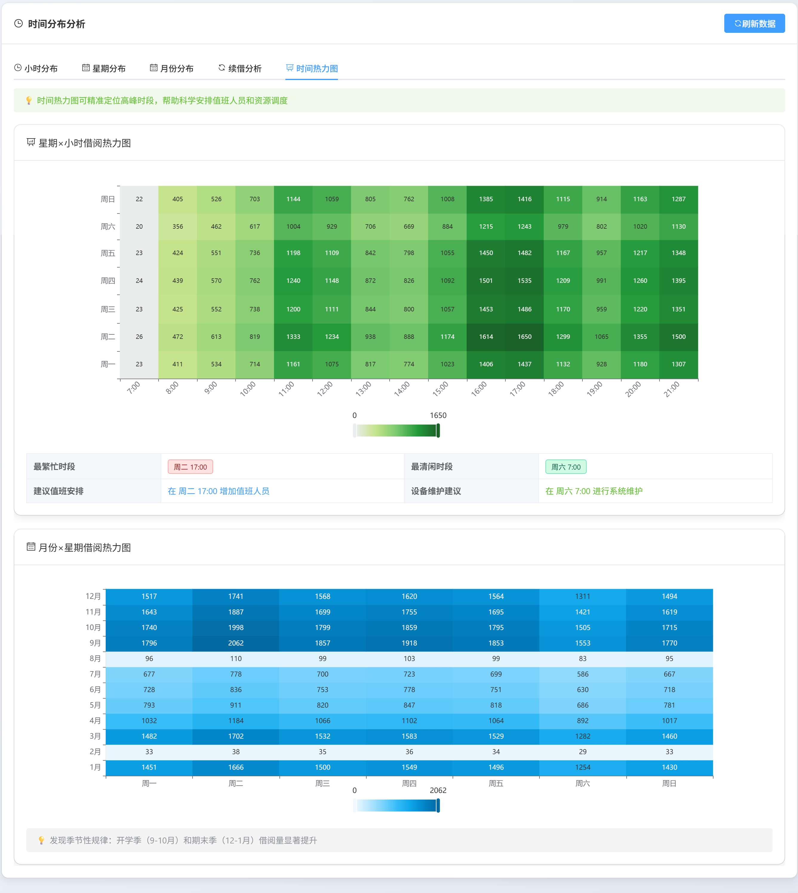 | 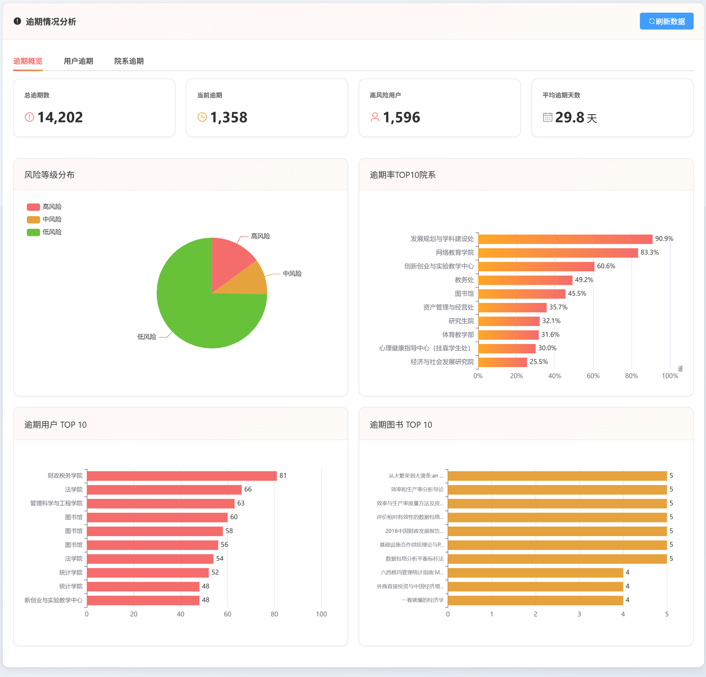 |


### 普通用户页面

| 个人中心 | 图书推荐 |
|-------|---------------|
| 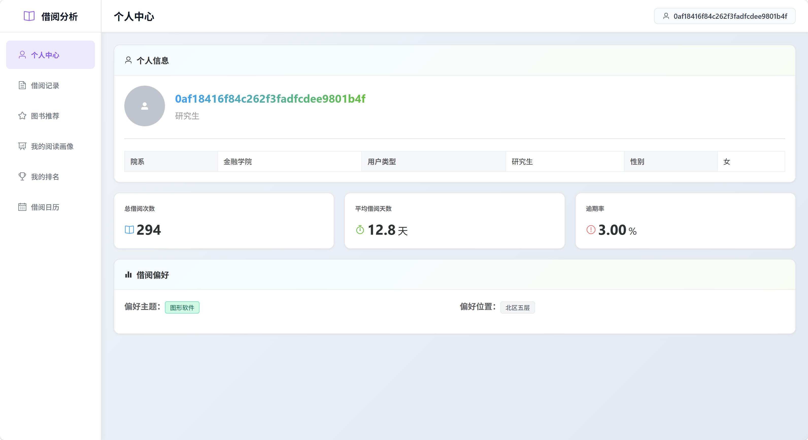 | 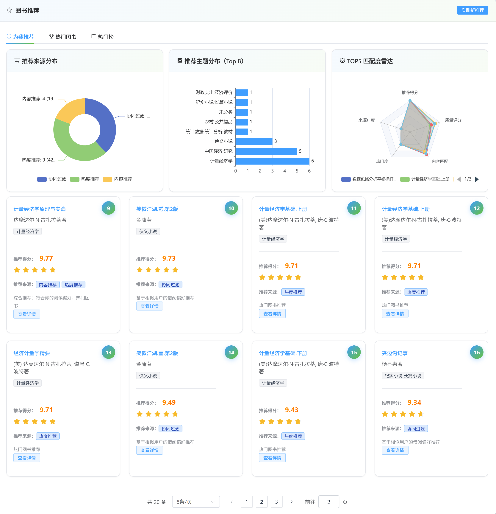 |

| 阅读画像 |
|-------------|
| 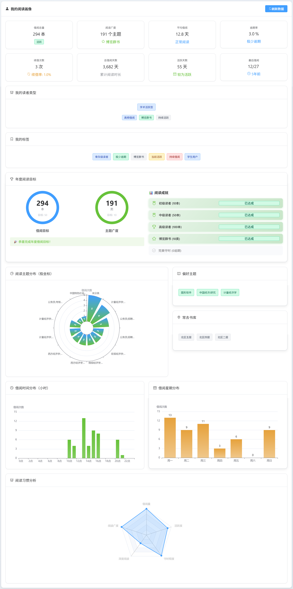 |

## 🤝 贡献

本项目为毕业设计项目，欢迎提出建议和反馈。

## 📄 许可证

本项目仅用于学习和研究目的。

## 👤 作者：林文俊

**毕业设计项目**

课题：基于Hive+Spark的高校图书馆借阅行为分析系统的设计与实现


